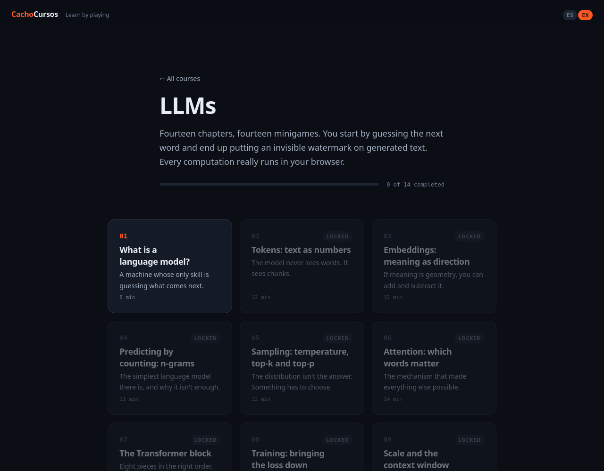

# CachoCursos

Interactive courses you learn by playing. Every chapter explains an idea and then
hands you a minigame that makes you use it, so the concept sticks before you move on.

**[cachocursos on GitHub Pages →](https://tetreum.github.io/cachocursos/)**



## What's inside

One course so far: **LLMs**, fourteen chapters from "what is a language model?" to
putting an invisible watermark on generated text. Available in Spanish and English.

Nothing is faked. The tokeniser really trains, the neural network really learns by
backpropagation, and the watermark is really detected — all of it running in your
browser, with no server and no API calls.

## Running it

```sh
npm install
npm run dev
```

Other commands: `npm test`, `npm run check`, `npm run lint`, `npm run build`.

Built with SvelteKit and deployed to GitHub Pages on every push to `master`.
